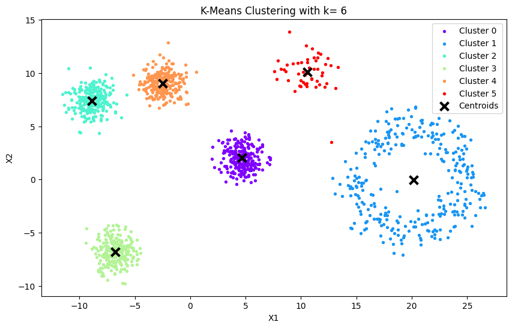
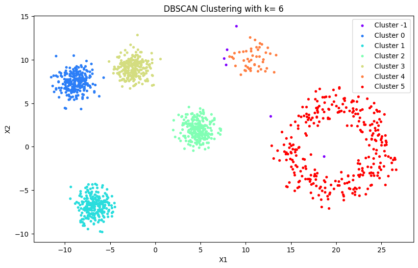
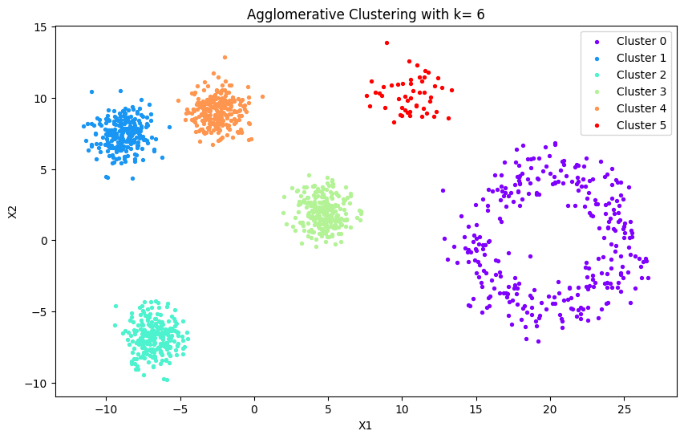

# Clustering Algorithms Comparison (K-Means, DBSCAN, Hierarchical)

Academic project comparing clustering performance on synthetic datasets.

## Overview
This project evaluates three key unsupervised learning algorithms:
- **K-Means** (centroid-based)
- **DBSCAN** (density-based)
- **Hierarchical Agglomerative Clustering**

[View full report](Clustering%20Experiments.pdf)

## Dataset Generation
`generate_data.py` creates three synthetic patterns:
1. **Gaussian Blobs**
2. **Moon Shapes** 
3. **Ring Distribution**

Controllable parameters:
- Noise level (`noise_level`)
- Point counts (`n_blobs`, `n_moons`, `n_ring`)

## Tested Algorithms
### 1. K-Means
- Implementation: `sklearn.cluster.KMeans`
- Key param: `n_clusters`
- Best result:
- 

### 2. DBSCAN
- Implementation: `sklearn.cluster.DBSCAN` 
- Critical params: `eps`, `min_samples`
- Best result:
- 

### 3. Hierarchical Clustering
- Implementation: `sklearn.cluster.AgglomerativeClustering`
- Tested linkages: `ward`, `complete`, `average`, `single`
- Best result:
- 
  
## Results & Findings
Complete analysis in Jupyter Notebook:  
[clustering_ex3.ipynb](clustering_ex3.ipynb)

Key insights:
- DBSCAN excels on non-convex shapes
- K-Means works best on spherical clusters  
- Hierarchical performance depends on linkage method

